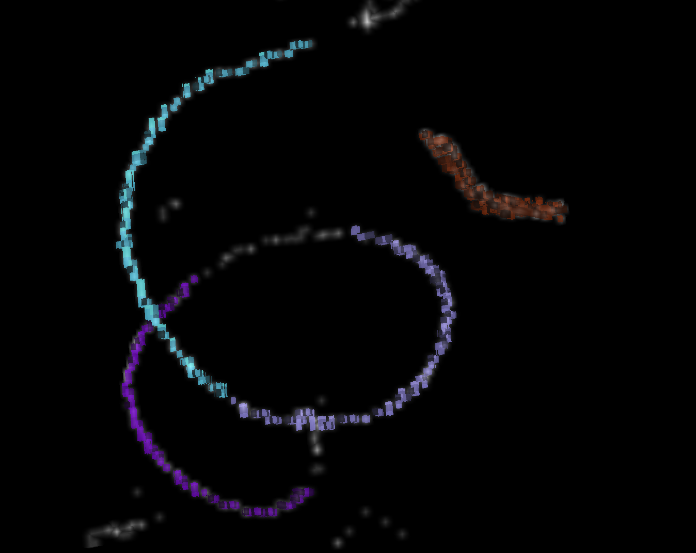
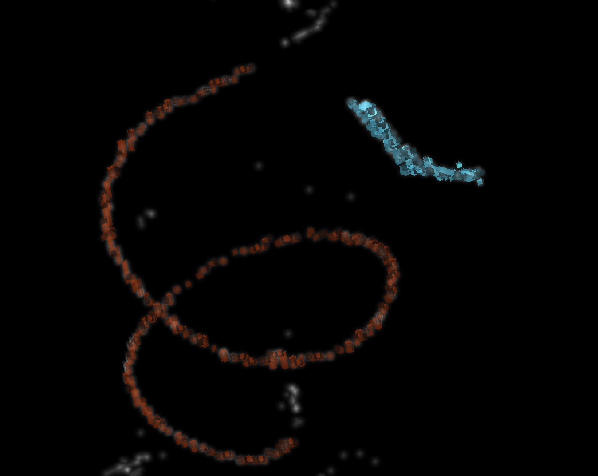
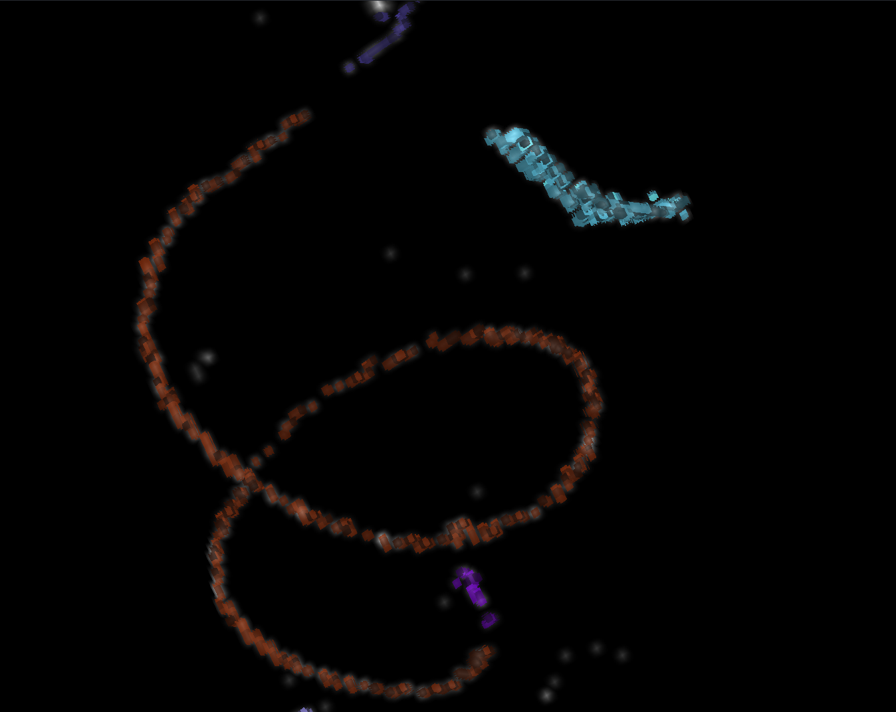

# Methods for the analysis of a segmented cochlea

The following code snippets will show how a single cochlea is analyzed.

## Labeling components
The component labeling for SGNs is quite reliable.
```bash
# locally
flamingo_tools.label_components --input "$MOBIE_DIR"/M_AMD_N162_L/tables/SGN_v2/default.tsv -o M_AMD_N162_L_v2.tsv --cell_type sgn
# access segmentation table on S3 bucket
flamingo_tools.label_components --input M_AMD_N162_L/tables/SGN_v2/default.tsv --s3 -o M_AMD_N162_L_v2.tsv --cell_type sgn
# check with napari
flamingo_tools.label_components --input M_AMD_N162_L/tables/SGN_v2/default.tsv --s3 -o M_AMD_N162_L_v2.tsv --cell_type sgn --napari
```

Labeling IHC components may require tuning of the `--max_edge_distance` and `--min_component_length` parameters and is usually an iterative process.

```bash
# locally
flamingo_tools.label_components --input "$MOBIE_DIR"/M_AMD_N162_L/tables/IHC_v4b/default.tsv -o M_AMD_N162_L_v4b.tsv --cell_type ihc
# access segmentation table on S3 bucket
flamingo_tools.label_components --input M_AMD_N162_L/tables/IHC_v4b/default.tsv --s3 -o M_AMD_N162_L_v4b.tsv --cell_type ihc
# check with napari
flamingo_tools.label_components --input M_AMD_N162_L/tables/IHC_v4b/default.tsv --s3 -o M_AMD_N162_L_v4b.tsv --cell_type ihc --napari
```

### Example

A typical process could look like this:
```bash
flamingo_tools.label_components --input M_AMD_N162_L/tables/IHC_v4b/default.tsv --napari --s3 -o M_AMD_N162_L_v4b.tsv --cell_type ihc
```

For the most part, the IHCs are correctly segmented, but there are some gaps between the labeled components.
The gap between components 2 (light blue) and 3 (light violet) is small, and a larger section between components 3 and 4 (dark violet) has been segmented but is not registered as a connected component. We can resolve these issues by increasing the `max_edge_distance` (default: 30 µm). Setting it to 50 or 70 µm is usually a good choice.

```bash
flamingo_tools.label_components --input M_AMD_N162_L/tables/IHC_v4b/default.tsv --napari --s3 -o M_AMD_N162_L_v4b.tsv --cell_type ihc --max_edge_distance 70 --force
```

The gap between components 2 and 3 has closed, and components 2, 3, and 4, as well as the section between 3 and 4, have fused into a single component.
However, there are isolated IHC instances at the top and bottom of the main component which we can see in the white and grey overlay.
There are too few IHCs to register as a connected component, so we decrease the minimum component length (default: 50 instances).
It can be set as low as two, but estimating the number of IHCs can help keep the representation clear and concise.
```bash
flamingo_tools.label_components --input M_AMD_N162_L/tables/IHC_v4b/default.tsv --napari --s3 -o M_AMD_N162_L_v4b.tsv --cell_type ihc --max_edge_distance 70 --min_component_length 20 --force
```

As we can see, the IHC spiral consists of components 1, 4, and 5. You can view the label by hovering over the component in Napari.
We can find the total number of IHCs by adding the parameter `-c` to our previous command.
Although the order of components 4, 1, and 5 does not matter in this instance, it is useful to keep in mind because it will be necessary for tonotopic mapping.
```bash
flamingo_tools.label_components --input M_AMD_N162_L/tables/IHC_v4b/default.tsv --s3 -o M_AMD_N162_L_v4b.tsv --cell_type ihc --max_edge_distance 70 --min_component_length 20 -c 4 1 5 --force
```
Output of the terminal:
```
Total IHCs: 926
Component 4 has 21 instances.
Component 1 has 511 instances.
Component 5 has 21 instances.
Custom component(s) have 553 IHCs.
```
Because we can not be sure, if all the components we selected are indeed IHCs, the components should be verified by visualizing them in MoBIE.

## Tonotopic mapping

The tonotopic mapping command is quite similar to the component labeling command, but it does require some additional information.
Specifically, the animal type must be specified because the parameters of the Greenwood function, which is used for frequency mapping, differ between mice and gerbils.
If the segmentation consists of multiple connected components, they must be in the same consecutive order as in the cochlear volume.
```bash
flamingo_tools.tonotopic_mapping --input M_AMD_N162_L_v4b.tsv --s3 -o M_AMD_N162_L_v4b.tsv --cell_type ihc --animal mouse --max_edge_distance 70  -c 4 1 5 --force
```
We can use the table we created after labeling the components as the input because the function only adds new columns without changing the existing ones.

## GFP annotation

For the analysis of optogenetic therapy, it is helpful to perform intensity evaluation on multiple crops along the segmentation.
To do this in an orderly manner, there is a function to determine equidistant centers, so coordinates which are equally spaced along the center of the Rosenthal's canal (for SGN) or
along the IHC segmentation.

```bash
flamingo_tools.equidistant_centers -i M_AMD_N162_L/tables/SGN_v2/default.tsv -o M_AMD_N162_L_crop.json -n 6 --s3
```

This command creates a JSON dictionary with six center coordinates which can be used with the function `flamingo_tools.extract_block`:

```bash
# for a single file
flamingo_tools.extract_block --input M_AMD_N162_L/images/ome-zarr/SGN_v2.ome.zarr -o crop.tif -c 300 300 400 --s3 --input_key s0 --force
# for multiple crops
flamingo_tools.extract_block --input M_AMD_N162_L/images/ome-zarr/SGN_v2.ome.zarr --json M_AMD_N162_L_crop.json -o <crop_folder> --s3 --input_key s0 --force
```

## Intensity analysis

This would calculate the PV intensity for the SGN segmentation
```bash
flamingo_tools.object_measures -o M-AMD-N162-L_PV_SGN-v2_object-measures.tsv \
    -i M_AMD_N162_L/images/ome-zarr/PV.ome.zarr \
    -t M_AMD_N162_L/tables/SGN_v2/default.tsv \
    -s M_AMD_N162_L/images/ome-zarr/SGN_v2.ome.zarr \
    --s3
```
