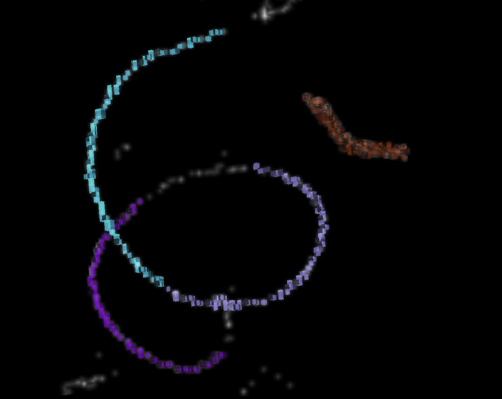
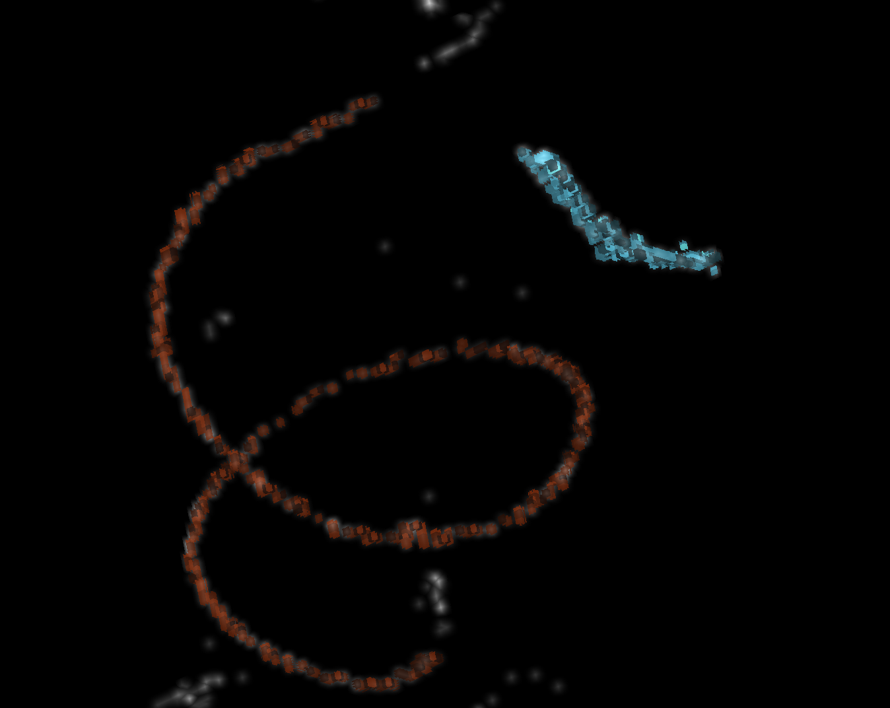
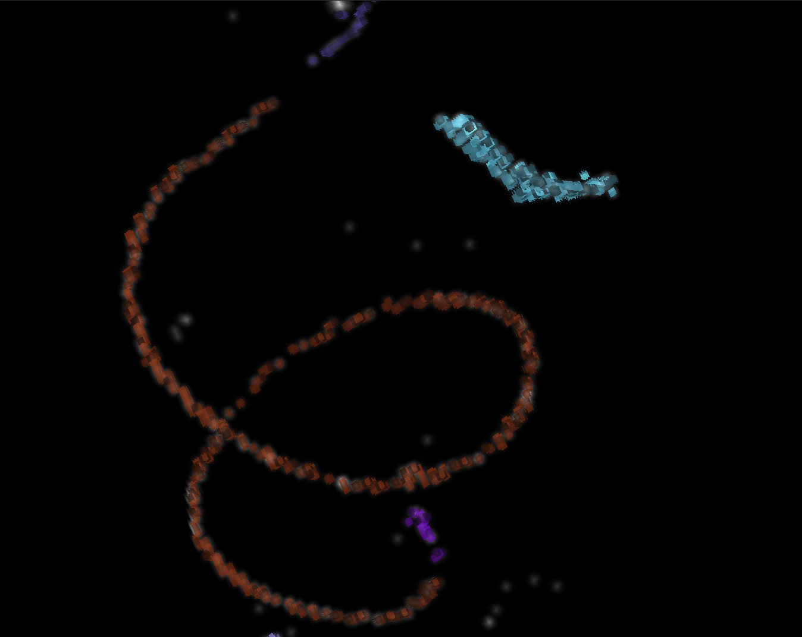

# Methods for the analysis of a segmented cochlea

The following code snippets will show how a single cochlea is analyzed.

## Labeling components
The component labeling for SGNs is quite reliable.
```bash
# locally
flamingo_tools.label_components --input "$MOBIE_DIR"/M_AMD_N162_L/tables/SGN_v2/default.tsv -o M_AMD_N162_L_v2.tsv --cell_type sgn
# access segmentation table on S3 bucket
flamingo_tools.label_components --input M_AMD_N162_L/tables/SGN_v2/default.tsv --s3 -o M_AMD_N162_L_v2.tsv --cell_type sgn
# check with napari
flamingo_tools.label_components --input M_AMD_N162_L/tables/SGN_v2/default.tsv --s3 -o M_AMD_N162_L_v2.tsv --cell_type sgn --napari
```

Labeling IHC components may require tuning of the `--max_edge_distance` and `--min_component_length` parameters and is usually an iterative process.

```bash
# locally
flamingo_tools.label_components --input "$MOBIE_DIR"/M_AMD_N162_L/tables/IHC_v4b/default.tsv -o M_AMD_N162_L_v4b.tsv --cell_type ihc
# access segmentation table on S3 bucket
flamingo_tools.label_components --input M_AMD_N162_L/tables/IHC_v4b/default.tsv --s3 -o M_AMD_N162_L_v4b.tsv --cell_type ihc
# check with napari
flamingo_tools.label_components --input M_AMD_N162_L/tables/IHC_v4b/default.tsv --s3 -o M_AMD_N162_L_v4b.tsv --cell_type ihc --napari
```

### Example

A typical process could look like this:
```bash
flamingo_tools.label_components --input M_AMD_N162_L/tables/IHC_v4b/default.tsv --napari --s3 -o M_AMD_N162_L_v4b.tsv --cell_type ihc
```

For the most part, the IHCs are correctly segmented, but there are some gaps between the labeled components.
The gap between components 2 (light blue) and 3 (light violet) is small, and a larger section between components 3 and 4 (dark violet) has been segmented but is not registered as a connected component. We can resolve these issues by increasing the `max_edge_distance` (default: 30 µm). Setting it to 50 or 70 µm is usually a good choice.

```bash
flamingo_tools.label_components --input M_AMD_N162_L/tables/IHC_v4b/default.tsv --napari --s3 -o M_AMD_N162_L_v4b.tsv --cell_type ihc --max_edge_distance 70 --force
```

The gap between components 2 and 3 has closed, and components 2, 3, and 4, as well as the section between 3 and 4, have fused into a single component.
However, there are isolated IHC instances at the top and bottom of the main component which we can see in the white and grey overlay.
There are too few IHCs to register as a connected component, so we decrease the minimum component length (default: 50 instances).
It can be set as low as two, but estimating the number of IHCs can help keep the representation clear and concise.
```bash
flamingo_tools.label_components --input M_AMD_N162_L/tables/IHC_v4b/default.tsv --napari --s3 -o M_AMD_N162_L_v4b.tsv --cell_type ihc --max_edge_distance 70 --min_component_length 20 --force
```

As we can see, the IHC spiral consists of components 1, 4, and 5. You can view the label by hovering over the component in Napari.
We can find the total number of IHCs by adding the parameter `-c` to our previous command.
Although the order of components 4, 1, and 5 does not matter in this instance, it is useful to keep in mind because it will be necessary for tonotopic mapping.
```bash
flamingo_tools.label_components --input M_AMD_N162_L/tables/IHC_v4b/default.tsv --s3 -o M_AMD_N162_L_v4b.tsv --cell_type ihc --max_edge_distance 70 --min_component_length 20 -c 4 1 5 --force
```
Output of the terminal:
```
Total IHCs: 926
Component 4 has 21 instances.
Component 1 has 511 instances.
Component 5 has 21 instances.
Custom component(s) have 553 IHCs.
```
Because we can not be sure, if all the components we selected are indeed IHCs, the components should be verified by visualizing them in MoBIE.

## Tonotopic mapping

The tonotopic mapping command is quite similar to the component labeling command, but it does require some additional information.
Specifically, the animal type must be specified because the parameters of the Greenwood function, which is used for frequency mapping, differ between mice and gerbils.
If the segmentation consists of multiple connected components, they must be in the same consecutive order as in the cochlear volume.
```bash
flamingo_tools.tonotopic_mapping --input M_AMD_N162_L_v4b.tsv --s3 -o M_AMD_N162_L_v4b.tsv --cell_type ihc --animal mouse --max_edge_distance 70  -c 4 1 5 --force
```
We can use the table we created after labeling the components as the input because the function only adds new columns without changing the existing ones.

## Intensity annotation

For the analysis of optogenetic therapy or the identification of SGN subtypes, the intensity of stains within SGN segmentation is evaluated.
Although evaluation is performed on the entire cochlear volume, manual thresholding on subvolumes is sufficient and the results can be extrapolated to the entire volume.

1) Multiple equidistant crops are extracted along the segmentation.
2) Object measures of the stains are calculated for each instance of the segmentation.
3) The crops are manually thresholded to classify positive and negative instances.
4) Finally, based on the manual thresholding, the entire cochlear volume is analyzed.

### 1 - Extraction of regions of interest (ROI) blocks

Sub-volumes in form of blocks are extracted to determine thresholds for positive/negative instances.

Create a JSON dictionary which will be used as the input for extracting central crops.
```bash
flamingo_tools.json_block_extraction -o M_AMD_N162_L.json -d M_AMD_N162_L -i PV SGN_v2 --cell_type sgn -c 1 -n 6 --roi_halo 256 256 64 -s SGN_v2
```
Provide this JSON file as input to the function
```bash
# s3 cluster
flamingo_tools.extract_central_blocks --input M_AMD_N162_L.json -o <output_dir> --s3
# local MoBIE project
flamingo_tools.extract_central_blocks --input M_AMD_N162_L.json -o <output_dir> --mobie_dir <mobie_project_dir>
```

#### Step-by-Step
The process can also be performed step-by-step.
This function provides coordinates that are equally spaced along the center of Rosenthal's canal (for SGN) or along the inner hair cell (IHC) segmentation.
```bash
flamingo_tools.equidistant_centers -i M_AMD_N162_L/tables/SGN_v2/default.tsv -o M_AMD_N162_L_crop.json -n 6 --s3
```
This command creates a JSON dictionary with six center coordinates which can be used with the function `flamingo_tools.extract_block`:
```bash
flamingo_tools.extract_block --input M_AMD_N162_L/images/ome-zarr/SGN_v2.ome.zarr -o <output_dir> --json_info M_AMD_N162_L_crop.json --s3
# or for a single crop center
flamingo_tools.extract_block --input M_AMD_N162_L/images/ome-zarr/SGN_v2.ome.zarr -o crop.tif -c x y z --s3
```

### 2 - Calculation of object measures

Before performing the thresholding in Napari, the intensity of the stain within the SGN segmentation is calculated.
The function `flamingo_tools.object_measures` can also take the same JSON file which was used for the block extraction as an input.
When working locally, the MoBIE directory can be given via the argument `--mobie_dir` to create the files directly in the appropriate locations,
e.g. under `<mobie_project>/<cochlea>/tables/<seg_name>/<stain>_<seg_name>_object-measures.tsv`.
If an output directory is specified, the output is given as:
`<cochlea>_<stain>_<seg_name>_object-measures.tsv`
```bash
# for creating the files in the MoBIE project
flamingo_tools.object_measures --mobie_dir <mobie_dir> --json_info M_AMD_N162_L.json

# for creating the files in an output directory reading the files from the S3 bucket
flamingo_tools.object_measures -o <output_dir> --json_info M_AMD_N162_L.json --s3

# calculate the PV intensity object measures without a JSON dictionary
flamingo_tools.object_measures -o M-AMD-N162-L_PV_SGN-v2_object-measures.tsv \
    -i M_AMD_N162_L/images/ome-zarr/PV.ome.zarr \
    --seg_table M_AMD_N162_L/tables/SGN_v2/default.tsv \
    --seg_path M_AMD_N162_L/images/ome-zarr/SGN_v2.ome.zarr \
    --s3
```
This is an example for the calculation of object measures using a background mask.
Once the background mask has been calculated it can be reused by supplying the explicit path.
If no path is specified, the background mask is only computed on the fly and not saved.
```bash
flamingo_tools.object_measures -i M_LR_000144_L/images/ome-zarr/GFP.ome.zarr \
    --seg_table M_LR_000144_L/tables/SGN_v2/default.tsv \
    --json_info /path/to/cochlea-net/reproducibility/object_measures/ChReef_MLR144L.json \
    --bg_cache_paths M_LR_000144_L_bg-mask.zarr \
    -o . --s3
```


#### 2a - For subtype analysis
You may want to calculate the ratio of subtype stains to a reference stain, e.g. the ratio of Calb1 and Ntng1 to PV.
You can use the script `scripts/measurements/sgn_subtype_ratio.py` for this.
Before executing the script, the relevant parameters for the cochlea can be added to `flamingo_tools/postprocessing/sgn_subtype_utils.py` to increase the reproducibility of the process.

### 3 - Manual intensity thresholding
For the annotation of GFP, the crops of PV, GFP, and SGN are needed.
For the annotation of Alphatag, the crops of Vglut3, Alphatag, IHC, and optionally Otof are needed.
The crop files are expected to have the format `<cochlea>_crop_xxx-yyy-zzz_<image_channel>.tif`.
The annotation tool in Napari is called using the common prefix `<cochlea>_crop_xxx-yyy-zzz` of all crops.
The GFP/Alphatag scenario is auto-detected from the stain files found for this prefix.
`--meas_table` takes the directory containing the per-channel object-measures tables, e.g. `<mobie_project>/<cochlea>/tables/<seg_name>`, and the matching table for each channel is found by its filename prefix, e.g. `Alphatag_IHC-v11_object-measures-bg-mask.tsv`, `Otof_IHC-v11_object-measures-bg-mask.tsv`.
```bash
python /path/to/cochlea-net-repository/scripts/intensity_annotation/intensity_annotation.py --meas_table <path_to_object_measures_dir> --prefix <common_prefix>
```
For the Alphatag scenario, thresholding is a two-step process: first threshold Alphatag expression, then switch to Otof (if present) via the channel selection box at the top right of the Napari window, and threshold it as well. The histogram, threshold slider, and visible image layer all follow the selected channel.

For each crop and channel, analysis requires two segmentation representations, which separate the instances into two groups through thresholding.
1) The first should separate the clearly negative instances from all instances, which might be seen as positive.
It should be named `<cochlea>_crop_<crop-coords>_<stain>_allWeakPositiveIncluded_<suffix>.tif`.
2) The second should separate the clearly positive instances from all instances, which might be seen as negative.
It should be named `<cochlea>_crop_<crop-coords>_<stain>_allNegativeExcluded_<suffix>.tif`.

Note: While the suffixes can be chosen freely, the other components are essential.

Based on these two files, the next processing step will calculate a threshold as a mean value between both groups - the clearly negative and the clearly positive instances.

### 4 - Analysing the marker annotation
All thresholding files should be placed in the same directory.
This directory is passed as the `-a, --annotation_dirs` argument.
If multiple annotators worked on the same crops, multiple annotation directories can be passed.
The function will check within all passed directories for annotations of the specified cochleae.
It is not required that every annotator has annotated every crop.
A summary of the intensities for all crops and annotators will be created as `<cochlea>_<stain>_<seg_name>_annotations.tsv`.

```bash
python /path/to/cochlea-net-repo/flamingo-tools/scripts/measurements/eval_marker_annotations.py -c M_LR_000143_L \
    -o /path/to/output_dir -t /optional/path/to/output_dir \
    -a /path/to/annotation/results/Results{LR,AMD,EK} \
    --seg_name SGN_v2 --marker_name GFP --s3
```
This command is equivalent to the one above, but specifies the input paths explicitly.
```bash
python /path/to/cochlea-net-repo/scripts/measurements/eval_marker_annotations.py -c M_LR_000143_L \
    -o /path/to/output_dir -t /optional/path/to/output_dir \
    -a /path/to/annotation/results/Results{LR,AMD,EK} \
    --seg_data M_LR_000143_L/images/ome-zarr/SGN_v2.ome.zarr \
    --seg_table M_LR_000143_L/tables/SGN_v2/default.tsv \
    --meas_table M_LR_000143_L/tables/SGN_v2/GFP_SGN-v2_object-measures.tsv \
    --seg_name SGN_v2 --marker_name GFP --s3
```
The analysis can also be performed locally. If the paths are as expected (see previous command), passing the `--mobie_dir` argument is sufficient:
```bash
python /path/to/cochlea-net-repo/scripts/measurements/eval_marker_annotations.py -c M_LR_000143_L \
    -o /path/to/output_dir -t /optional/path/to/output_dir \
    -a /path/to/annotation/results/Results{LR,AMD,EK} \
    --mobie_dir <local_mobie_dir> \
    --seg_name SGN_v2 --marker_name GFP
```
If no output directory is passed, the output will be saved as a table in `<mobie_project>/<cochlea>/tables/<seg_name>/<marker_name>_<seg_name>.tsv`.

The `--column` argument selects the column of the measurement table that the threshold applies to, and `--bg_mask` reads the object measures computed with a background mask.
The threshold rule is unchanged: it stays the value between the clearly positive and the clearly negative population, only measured on another column.

The `-t, --threshold_save_dir` argument saves the thresholds as `<cochlea>_<stain>_<seg_name>.json`.
For each crop, this file contains the threshold averaged over all annotators as `median_intensity`, and the threshold of each single annotator as `annotator_intensities`.
The annotator name is the name of the annotation directory, e.g. `ResultsAMD`.

#### Variability between annotators
The `--variance` argument evaluates how much the marker assignment depends on the annotator.
The thresholds of a single annotator are applied to the whole cochlea, which gives one scenario per annotator.
These scenarios are compared to each other and to the `median` scenario, which uses the thresholds averaged over all annotators.
Crops without a threshold for an annotator are left out of the scenario of this annotator.
The result is saved as `<cochlea>_<stain>_<seg_name>_variance.json` in the threshold directory, or in the output directory if no threshold directory is passed.
It contains the percentage of positive and negative instances per scenario, the variance of these percentages over all annotators, and a breakdown per crop.

### 4a - Subtype analysis
The same functionality applies to subtype analysis as to marker annotation.
```bash
python /path/to/cochlea-net-repo/scripts/measurements/eval_subtype_annotations.py -c M_LR_N152_L \
    -o /path/to/output_dir -t /optional/path/to/output_dir \
    -a /path/to/annotation/results/Results{LR,AMD,EK} \
    --s3
```
The cochlea is processed for every subtype stain in the `COCHLEAE` dictionary of `flamingo_tools/postprocessing/sgn_subtype_utils.py`.
The `--variance` argument creates one threshold variance file per stain, `<cochlea>_<stain>_<seg_name>_variance.json`.
The file has the same format as the file for the marker annotation.
If a custom threshold in `CUSTOM_THRESHOLDS` overrides the annotations of a stain, the `median` scenario still uses the annotated thresholds, so that the comparison stays between annotators.
The item `custom_thresholds` records this case.

#### Variability of the subtypes
A subtype follows from a pair of stains, see `STAIN_TO_TYPE` in `flamingo_tools/postprocessing/sgn_subtype_utils.py`.
To evaluate the variability of the subtypes, pass the directory with the threshold variance files to `scripts/assign_subtypes.py`.
```bash
python /path/to/cochlea-net-repo/scripts/assign_subtypes.py -c M_LR_N152_L \
    -o /path/to/output_dir --variance /path/to/variance_dir
```
The directory is searched for the default file name of every subtype stain of the cochlea.
If the files are found, the thresholds of each annotator are applied again to the whole cochlea, and the subtypes are assigned for this annotator alone.
The result is saved as `<cochlea>_subtypes_variance.json`.
It contains the number and the percentage of instances per subtype for each annotator, the variance of the percentages over all annotators, and the difference to the `median` scenario.
An annotator must have annotated every stain of a pairing. Other annotators are skipped with a warning.


### 4b - Automatic intensity thresholding
The script `scripts/measurements/apply_marker_thresholds.py` assigns the marker labels without annotations.
An instance is positive when it reaches every threshold of its cochlea in the `THRESHOLD_DICT` dictionary of the script.
Several columns can be combined this way, which is what the OTOF cochleae need.
A cochlea without an entry falls back to an Otsu threshold on a single column and prints a warning that the threshold is not validated.
The output has the same format as the annotation based path of step 4, so both can be compared directly.

```python
THRESHOLD_DICT = {
    "M_AMD_OTOF27_L": {"median_bg": 23, "p95_sub_p5": 240},
    ...
}
```

The features are the columns of the object-measures tables, plus:
- `median_bg`, the median of the table computed with a background mask;
- `p95_sub_p5`, `p90_sub_p10`, `p90_sub_median` and `iqr`, differences of percentiles of the plain table.

A percentile difference measures the contrast within an object. It does not depend on the local background level, because the offset cancels in the difference.

For the OTOF cochleae the rule is a level test on `median_bg` plus a contrast gate `p95_sub_p5 >= 240`, which is shared by all four cochleae.
The level alone is not sufficient. It calls IHCs positive that sit on a raised background but have no bright substructure, for example the label ids 185 to 189 of `M_AMD_OTOF27_L`.
The contrast gate removes them, because their `percentile-95` minus `percentile-5` stays near 100.
`M_AMD_OTOF27_R` is an all-negative control. Its highest `p95_sub_p5` is 116, so the gate keeps it at zero positives.

The marker group selects the cochleae, the segmentation and the marker stain.
The connected components of each cochlea are stored in the dictionaries `COCHLEAE_OTOF` and `COCHLEAE_CHREEF` of the script.
```bash
# Otof marker on IHC segmentation, segmentation table from S3 and object measures from disk
python /path/to/cochlea-net-repo/scripts/measurements/apply_marker_thresholds.py -g otof --s3 \
    --meas_dir ./otof_object_measures -o /path/to/output_dir -t /path/to/output_dir -p /path/to/plot_dir

# ChReef marker on SGN segmentation, single cochlea, Otsu fallback
python /path/to/cochlea-net-repo/scripts/measurements/apply_marker_thresholds.py -g chreef --s3 \
    -c M_LR_000144_L -o /path/to/output_dir -t /path/to/output_dir
```
The tables are found in `<cochlea>/tables/<seg_name>` by the file name `<stain>_<seg_name>_object-measures[-bg-mask].tsv`.
Both the plain and the background-subtracted table are read when both exist, so that a rule can use features of either.
`--meas_dir` reads the tables from a directory instead, by the file name `<cochlea>_<stain>_<seg_name>_object-measures[-bg-mask].tsv`.
Use it when the percentile columns are only available locally, as for the OTOF cochleae.
`--meas_table` passes one table explicitly, `--components` overrides the components of the dictionary, and `--threshold` sets a single threshold on `--intensity_column` without editing the script.

The segmentation table is saved as `<cochlea>_<stain>_<seg_name>.tsv`, with the assignment in the `marker_labels` column.
A positive instance is 1, a negative instance is 2, and an instance outside the components or without an object measure is 0.
The `-t, --threshold_save_dir` argument saves the thresholds as `<cochlea>_<stain>_<seg_name>.json`, with the method, every threshold, the counts and percentages, and the percentage of instances that pass each threshold on its own.
These keys match the variance files of step 4, so the automatic and the annotated percentages can be compared per cochlea.
The `-p, --plot_dir` argument saves a histogram for a rule with one feature, and a scatter plot of the first two features for a rule with several.

#### Local thresholds per crop
One threshold per cochlea ignores that the imaging conditions change along the cochlea.
The annotation crops sit at six positions, and the thresholds differ strongly between them, for example from 62 to 303 within `M_AMD_OTOF27_L`.
The `--local` argument uses one threshold per crop, from the `LOCAL_THRESHOLD_DICT` dictionary of the script.
```bash
python /path/to/cochlea-net-repo/scripts/measurements/apply_marker_thresholds.py -g otof --s3 --local \
    --meas_dir ./otof_object_measures --bg_dir ./otof_object_measures_bg-mask \
    -o /path/to/output_dir -t /path/to/output_dir -p /path/to/plot_dir
```
Each threshold is the value between the two populations of its crop, the same rule that `get_crop_parameters` applies to an annotated crop: the middle between the highest negative and the lowest positive instance.
The thresholds can therefore be reproduced by hand from the annotations, and are not tuned against an accuracy measure.

The column is the background-subtracted `mean`, written `mean_bg` in the feature table.
It separated the annotated populations better than any other column of the background-subtracted object measures, see the ranking below.

The assignment follows the same principle as step 4.
Each crop center is mapped onto the `length_fraction` of the cochlea, and the crop governs the band up to the middle of the distance to its neighbour.
The mapping runs on the instances of the connected components only, because an instance outside them carries a placeholder length fraction of 0, which would pull the crop positions toward the start of the cochlea.
The segmentation table therefore needs the `length_fraction` column, which the tonotopic mapping adds.

A crop in which the annotators found no positive instance gets an infinite threshold, so its whole band stays negative.
This replaces the convention of 1.5 times the highest median, which depended on a maximum measured elsewhere in the cochlea.
`M_AMD_OTOF27_R` is such a case for all six of its crops.

The threshold JSON records `"scope": "local"` and a per-crop breakdown with the threshold, its length fraction, its band and the counts inside it.
The plot shows the feature over the length fraction, with one threshold line per band.
Instances whose `length_fraction` is exactly 0 or 1 fall between the bands and stay unassigned, which affects a handful of instances per cochlea.
A cochlea that is not in `LOCAL_THRESHOLD_DICT` warns and falls back to the thresholds of the whole cochlea.

#### Deriving a threshold from annotated crops
`scripts/measurements/eval_marker_thresholds.py` derives the thresholds and reports how well they reproduce the annotations.
It needs the segmentation crops that the annotators worked on, the per-crop thresholds from step 4, and the object measures.
For each crop it applies the annotator threshold to the instances of that crop, which gives a reference label per instance.
```bash
python /path/to/cochlea-net-repo/scripts/measurements/eval_marker_thresholds.py \
    --crop_dir otof_crops --threshold_dir otof_crop_thresholds --meas_dir otof_object_measures \
    -o otof_threshold_sweep.json
```
The `--local` argument fits one threshold per crop instead, and compares the local and the global result leave-one-instance-out.
`--positive_weight` sets how much a reference-positive instance counts when a threshold is chosen and when it is scored, which matters for Otof, where a missed positive weighs more than a missed negative.
```bash
python /path/to/cochlea-net-repo/scripts/measurements/eval_marker_thresholds.py --local \
    --level mean --positive_weight 3 -o otof_local_sweep.json
```

Without `--level` the script ranks combinations of a level feature and a contrast gate.
The gate threshold is shared by all cochleae and the level threshold is fitted per cochlea, which keeps the number of free parameters low.
The ranking uses a repeated 5-fold cross validation, not the in-sample error, because a rule with more parameters always fits the annotations better.
For the OTOF cochleae the chosen rule makes 18 errors on 499 annotated instances and 20.4 under cross validation, against 18 and 24.9 for a single threshold on `percentile-90`.
The script prints `THRESHOLD_DICT` entries that can be pasted into `apply_marker_thresholds.py`.
A plateau marked with `*` is unbounded, which means the data of that cochlea does not pin the threshold.

#### Choosing the column of the background-subtracted object measures
The `--columns` argument of `eval_marker_thresholds.py` ranks the columns of the background-subtracted object measures.
For every annotated crop it keeps the split that the annotators made, and asks how well one threshold on the candidate column reproduces it.
The threshold is the value between the two populations, so the ranking compares columns, not fitting procedures.
```bash
python /path/to/cochlea-net-repo/scripts/measurements/eval_marker_thresholds.py --columns \
    --meas_dir ./otof_object_measures --bg_dir ./otof_object_measures_bg-mask \
    --crop_dir ./otof_crops --threshold_dir ./otof_crop_thresholds -o otof_column_ranking.json
```
The result for the OTOF cochleae, over the 17 annotated crops that contain positive instances:

| column | crops separated | errors |
|---|---|---|
| `mean` | 14 | 8 |
| `percentile-75` | 13 | 10 |
| `median` | 13 | 13 |
| `percentile-90` | 13 | 15 |
| `percentile-95` | 12 | 16 |
| `max` | 5 | 41 |

"Separated" counts the crops in which the two populations do not overlap at all, so a single threshold classifies every instance of that crop correctly.
The `median` row of the reference table is circular, because the split was derived from it; the row above compares the rebuilt `median` on equal terms.
`mean` is the best column and is the one used by `LOCAL_THRESHOLD_DICT`.

#### A note on background-subtracted tables
Object measures written with `--bg_mask` before the fix of `_normalize_background` are not usable.
The median was not subtracted at all, and every other statistic was subtracted by its own background counterpart rather than by one background level, which makes the percentiles of an object non-monotonic.
Both scripts detect this from the percentile order and repair the table, if the matching table written with `median_only=True` is passed with `--bg_reference_dir`.
Regenerate the object measures to remove that step.

### Example for standard output table

For an easier analysis, it makes sense to limit entries in the segmentation table to segmentation instances in specific components.
This can either be a single component or multiple components if the cochlea is broken.
However, it makes sense to still keep other entries in case they may be relevant for later analysis.
Therefore, a table with the main parameters is created based on the `default.tsv` segmentation table and other object measures.

#### Changes for the main table
The main table adds a `volume[µm³]` column, which is the `n_pixels` column multiplied by the voxel size.
The distance from the center to the RC can be found in the column `offset` in the original segmentation table. When the main table is created, it is renamed into `dist_from_center[µm]` for SGNs.
It also includes entries for the mean intensity within a cell, if a table with the object measures is provided. I would recommend to test this without calculating the background subtracted mean intensity, because this step currently takes quite long.

#### Not yet included
The columns for colocalization thresholding are currently added independently from this function using the `scripts/measurements/eval_marker_annotations.py` and `scripts/measurements/eval_subtype_annotations.py` scripts (see above).
The added columns are `marker_labels` for GFP/rbOtof and `marker_<stain>` for subtypes. Additionally, a column `subtype_label` is added for subtype analysis.

#### Example
The following example shows a series of commands for the cochlea `M_LR_000153_L` which was used for the publication.

```bash
# label components
flamingo_tools.label_components -i MLR153L_default.tsv -o MLR153L_labeled.tsv --cell_type sgn -c 1 2 3

# tonotopic mapping
flamingo_tools.tonotopic_mapping -i MLR153L_labeled.tsv -o MLR153L_tonotopic.tsv --cell_type sgn -c 1 2 3 --animal mouse

# this create a JSON dictionary, which can be used as input for further analysis
flamingo_tools.json_block_extraction -o M_LR_000153_L.json -d M_LR_000153_L -i PV CR GFP SGN_v2 --cell_type sgn -c 1 2 3  -n 6 --roi_halo 256 256 64 -s SGN_v2

# this creates object measures without using a background mask,
flamingo_tools.object_measures -o . --json_info M_LR_000153_L.json --s3

# this creates object measures with using a background mask
flamingo_tools.object_measures -o . --json_info M_LR_000153_L.json --s3 --bg_mask

# explicit paths for a single stain (PV) using a background mask
flamingo_tools.object_measures --image_paths M_LR_000153_L/images/ome-zarr/PV.ome.zarr --seg_table M_LR_000153_L/tables/SGN_v2/default.tsv --seg_path M_LR_000153_L/images/ome-zarr/SGN_v2.ome.zarr -c 1 2 3 --bg_mask --s3

# example with object measures
python /path/to/cochlea-net/scripts/create_main_table.py --input MLR153L_tonotopic.tsv \
    --json_info M_LR_000153_L.json \
    --meas_tables M-LR-000153-L_GFP_SGN-v2_object-measures-bg-mask.tsv M-LR-000153-L_PV_SGN-v2_object-measures.tsv M-LR-000153-L_GFP_SGN-v2_object-measures.tsv  M-LR-000153-L_CR_SGN-v2_object-measures.tsv \
    --output MLR153L_filtered.tsv
```
